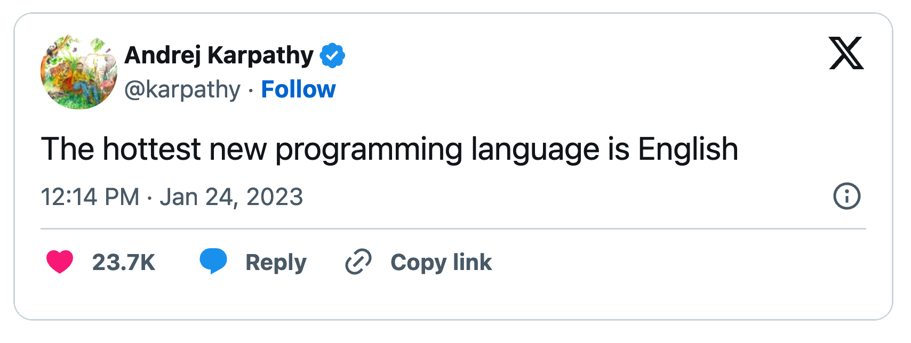
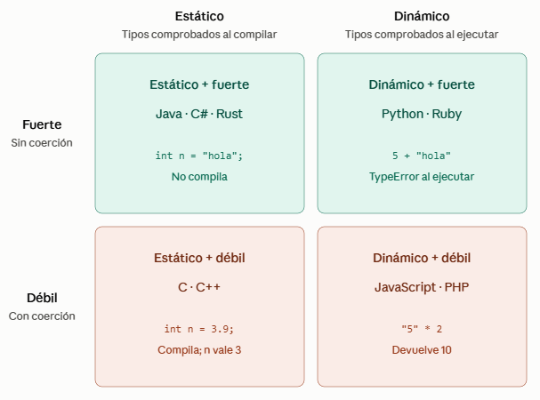

# UP01 (AMPLIACIÓN): FUNDAMENTOS Y PROCESO DE DESARROLLO DEL SOFTWARE

> [!IMPORTANT]
> Los apartados **1 a 4** coinciden con el tema de la UP01 que ya habéis trabajado; solo se han añadido algunas imágenes. **Lo nuevo empieza en el apartado 5**.

## ÍNDICE

- [OBJETIVOS](#objetivos)
- [CÓMO TRABAJAR ESTA UNIDAD](#cómo-trabajar-esta-unidad)
- [0. ANTES DE EMPEZAR](#0-antes-de-empezar)
  - [0.1. Vocabulario básico](#01-vocabulario-básico)
  - [0.2. Preparar las herramientas](#02-preparar-las-herramientas)
- [1. CONCEPTO DE PROGRAMA INFORMÁTICO](#1-concepto-de-programa-informático)
  - [1.1. Ejecución y almacenamiento de los programas](#11-ejecución-y-almacenamiento-de-los-programas)
  - [1.2. Clasificación funcional de los programas](#12-clasificación-funcional-de-los-programas)
  - [1.3. Calidad: características deseables de los programas](#13-calidad-características-deseables-de-los-programas)
- [2. LENGUAJES DE PROGRAMACIÓN: DEFINICIÓN Y CONCEPTOS](#2-lenguajes-de-programación-definición-y-conceptos)
- [3. CLASIFICACIÓN DE LOS LENGUAJES DE PROGRAMACIÓN](#3-clasificación-de-los-lenguajes-de-programación)
- [4. CÓDIGO Y MÁQUINAS VIRTUALES](#4-código-y-máquinas-virtuales)
- [5. DESARROLLAR SOFTWARE ES MÁS QUE PROGRAMAR](#5-desarrollar-software-es-más-que-programar)
- [6. LAS FASES DEL DESARROLLO](#6-las-fases-del-desarrollo)
- [7. CÓMO ORGANIZAMOS EL DESARROLLO](#7-cómo-organizamos-el-desarrollo)
- [8. LAS HERRAMIENTAS Y SU FINALIDAD](#8-las-herramientas-y-su-finalidad)
- [9. AGILIDAD, SCRUM Y KANBAN](#9-agilidad-scrum-y-kanban)
- [10. DE UNA NECESIDAD A UN TRABAJO COMPROBABLE](#10-de-una-necesidad-a-un-trabajo-comprobable)
- [REFERENCIAS](#referencias)

## OBJETIVOS

Al terminar esta unidad deberíais poder:

- Diferenciar los conceptos de **programa**, **software** y **proceso**, y relacionar la ejecución de un programa con almacenamiento, memoria, sistema operativo y procesador.
- Distinguir **software de sistema** y **software de aplicación**, así como diferentes formas de adquisición y adaptación del software.
- Reconocer características relevantes de la **calidad del software**, incluyendo corrección, eficiencia, seguridad, usabilidad, accesibilidad, mantenibilidad, testabilidad, portabilidad, reusabilidad e interoperabilidad.
- Explicar qué es un **lenguaje de programación** y distinguir sus componentes léxicos, sintácticos y semánticos.
- Reconocer tipos de datos básicos y compuestos.
- Clasificar lenguajes por **nivel de abstracción**, **forma de ejecución**, **paradigma**, **sistema de tipos** y **propósito**.
- Diferenciar **código fuente, código objeto, código ejecutable y código intermedio**, y reconocer el papel de compiladores, enlazadores y máquinas virtuales.
- Identificar las fases del desarrollo de una aplicación a partir de situaciones concretas.
- Distinguir **planificación predictiva**, **iteración** e **incremento**.
- Elegir un tipo de herramienta según el problema que necesitáis resolver y diferenciar la finalidad de IDE, depuradores, control de versiones, plataformas de colaboración, integración continua, modelado, pruebas y análisis estático.
- Reconocer las ideas fundamentales del desarrollo ágil y los usos básicos de **Scrum** y **Kanban**.
- Interpretar una **historia de usuario**, sus **criterios de aceptación**, las tareas necesarias para realizarla y su relación con requisitos, pruebas y definición de terminado.

El bloque dedicado a fases, herramientas y metodologías trabaja principalmente los criterios **b, f y g del RA1**: fases del desarrollo, funcionalidad de las herramientas y características y escenarios de las metodologías ágiles.

## CÓMO TRABAJAR ESTA UNIDAD

Esta ampliación reúne dos perspectivas que deben entenderse como complementarias.

La primera mitad responde a preguntas como **qué es un programa, en qué se diferencia del software, cómo se expresa mediante un lenguaje y cómo llega a ejecutarse en una máquina**. La segunda responde a **cómo se transforma una necesidad en software, qué fases atraviesa ese trabajo, qué herramientas intervienen y cómo puede organizarse el desarrollo**.

La primera mitad (apartados 1 a 4) es el tema que ya conocéis: podéis repasarla o pasar directamente a la segunda. Leedla de nuevo si queréis ver las imágenes añadidas sobre el ciclo de vida de un proceso, la «sexta generación» de lenguajes y la matriz de tipado.

No necesitáis dominar programación para empezar. El apartado 0 comprueba operaciones básicas con archivos y herramientas. Después se construye el vocabulario técnico antes de utilizarlo dentro de un proceso de desarrollo completo.

A lo largo de la segunda mitad utilizaremos como hilo conductor una aplicación para reservar tutorías en una academia. El mismo caso permite relacionar requisitos, diseño, implementación, pruebas, herramientas, iteración, Scrum, Kanban e historias de usuario.

## 0. ANTES DE EMPEZAR

### 0.1. Vocabulario básico

Un **programa** contiene instrucciones para realizar una tarea. El término **software** es más amplio: puede incluir varios programas, datos y documentación asociados. Estas son algunas palabras que usaremos desde el principio:

| Concepto | Qué significa | Ejemplo |
|---|---|---|
| Sistema operativo | Software que gestiona el equipo y permite utilizar aplicaciones. | Windows, macOS o una distribución de Linux. |
| Archivo | Información guardada con un nombre. | `notas.txt`. |
| Carpeta | Ubicación que permite organizar archivos y otras carpetas. | Una carpeta `EDE` para el módulo. |
| Extensión | Parte final de muchos nombres de archivo que indica su tipo habitual. | `.txt` en `notas.txt`. |
| Ruta | Dirección que permite localizar un archivo o carpeta. | `C:\EDE\notas.txt` en Windows. |
| Código fuente | Texto con instrucciones escritas en un lenguaje de programación. | El contenido de un archivo `Hola.java`. |
| Proyecto | Conjunto organizado de archivos y configuración de una aplicación. | Código, pruebas y documentación de la aplicación de tutorías. |

**Descargar** un instalador lo guarda en vuestro equipo; **instalar** prepara la aplicación para utilizarla; **abrir** inicia la aplicación. Son operaciones distintas. Tampoco cambiáis el contenido de un archivo por cambiar su extensión: renombrar `entrega.tar.gz` como `entrega.zip` no convierte un archivo comprimido en otro. La extensión es solo una pista para el sistema operativo y las aplicaciones sobre cómo tratar el archivo. 

**Comprobación inicial:** ¿podéis crear una carpeta, guardar dentro un archivo de texto, cerrarlo y volver a encontrarlo? ¿Distinguís la aplicación con la que lo abrís del archivo que contiene vuestro trabajo? Si no, practicad estas operaciones antes de crear proyectos. La preparación siguiente os permite hacerlo.

### 0.2. Preparar las herramientas

En este módulo utilizaremos **JetBrains Toolbox App** para instalar y gestionar **IntelliJ IDEA** y **CLion**. Instalaremos **Visual Studio Code**, también llamado VS Code, por separado.

| Aplicación | Función en nuestro entorno |
|---|---|
| JetBrains Toolbox App | Instalar, abrir y gestionar las herramientas de JetBrains. |
| IntelliJ IDEA | Trabajar principalmente con proyectos Java. |
| CLion | Trabajar con proyectos C y C++. |
| VS Code | Editar archivos de texto, documentación y código. Sus funciones se pueden ampliar mediante extensiones. |

**Preparación guiada:**

1. Descargad [JetBrains Toolbox App](https://www.jetbrains.com/toolbox-app/) para vuestro sistema operativo y completad su instalación.
2. Abrid Toolbox y localizad **IntelliJ IDEA** y **CLion**. Instalad ambos desde allí, con la versión indicada para el curso; si no se ha fijado una, elegid una versión estable. Toolbox permite gestionar las dos aplicaciones desde un mismo lugar. **CLion** es sólo para una pequeña demostración práctica, luego podéis desinstalarlo si no lo vais a usar.
3. Abrid cada entorno y comprobad que llegáis a su pantalla de bienvenida. A priori deberíais poder solicitar las funciones *Ultimate* de IntelliJ completando el proceso de registro con vuestra cuenta de correo institucional (alumno). Si no, para este curso es más que suficiente con las funcionalidades gratuitas.
4. Descargad e instalad [Visual Studio Code](https://code.visualstudio.com/download) desde su web. Buscad ese nombre completo: Visual Studio es otro producto.
5. Cread una carpeta `EDE` en una ubicación que sepáis encontrar. Desde VS Code, abrid esa carpeta, cread `notas.txt`, escribid una frase y guardadla. Cerrad el archivo y volved a abrirlo para comprobar que el contenido sigue ahí.

Las guías oficiales de [IntelliJ IDEA](https://www.jetbrains.com/help/idea/installation-guide.html), [CLion](https://www.jetbrains.com/help/clion/installation-guide.html) y [VS Code](https://code.visualstudio.com/docs/getstarted/overview) recogen los pasos para cada sistema operativo.

**Resultado esperado:** sabéis abrir las tres herramientas y localizar vuestro archivo. En las futuras unidades crearemos proyectos y comprobaremos su configuración. Para Java revisaremos el **JDK**, el conjunto de herramientas de desarrollo de Java; para C/C++, el compilador y demás herramientas de construcción. En Windows, CLion incluye **MinGW**, un conjunto de herramientas para construir programas C/C++. [Documentación de instalación de CLion](https://www.jetbrains.com/help/clion/installation-guide.html).

## 1. CONCEPTO DE PROGRAMA INFORMÁTICO

Un **programa informático** es una secuencia de instrucciones lógicas y ordenadas, escritas en un lenguaje de programación específico, que un ordenador puede interpretar y ejecutar para realizar una tarea concreta o resolver un problema. En esencia, un programa es el conjunto de órdenes que le dice al hardware (los componentes físicos del ordenador) qué debe hacer, cómo y en qué secuencia.

A menudo, este concepto se utiliza indistintamente con el de **software**, pero es útil entender su relación jerárquica para ser precisos. Un programa es la unidad fundamental del software (por ejemplo, la aplicación "Calculadora"), mientras que el software es un término más amplio que puede englobar un conjunto de programas que trabajan juntos (la suite "Microsoft Office") o un sistema operativo completo ("Windows 11"). Por lo tanto, todo programa es software, pero el software no es necesariamente un único programa.

Para que un programa pueda funcionar en un ordenador, debe recorrer un camino desde la idea del programador hasta las órdenes que el procesador entiende. Este proceso comienza con el **código fuente**, que son las instrucciones legibles para los humanos escritas en un **lenguaje de programación concreto** como Java, C# o Python. Dado que el procesador solo comprende un lenguaje de ceros y unos, conocido como **código máquina**, este código fuente necesita ser traducido.

Como primer mapa mental, esta traducción puede entenderse mediante tres modelos principales. En los apartados 3.2 y 4 volveremos sobre ellos con más detalle:

- La **Compilación** traduce todo el código en un proceso secuencial de varias etapas que culmina en la creación de un fichero autónomo que la máquina puede ejecutar directamente.
- Por otro lado, la **Interpretación** lee y ejecuta el código línea por línea, en tiempo real, sin crear un fichero ejecutable previo.
- Por último, hoy en día, es muy común un **Modelo Híbrido**, usado por lenguajes como Java o los de la plataforma .NET: el código fuente se compila primero a un código intermedio llamado **bytecode**, y es una **Máquina Virtual** (un software que simula ser un ordenador) la que se encarga de ejecutar este bytecode, ofreciendo una gran portabilidad entre distintos sistemas operativos.

El resultado final de la compilación es el **código ejecutable** o **binario**, un fichero que contiene las instrucciones en código máquina (cadenas de 0s y 1s sólo comprensibles por la máquina). La forma de identificar estos ficheros varía según el sistema operativo: en la familia **Windows**, se utiliza comúnmente la extensión `.exe`; mientras que en sistemas **Unix/Linux**, no se requiere una extensión específica, sino que se marca el fichero con un permiso de ejecución. En ambos casos, el concepto es el mismo: un fichero listo para ser ejecutado por la CPU.

### 1.1. EJECUCIÓN Y ALMACENAMIENTO DE LOS PROGRAMAS

Un programa reside como un fichero ejecutable inactivo en un almacenamiento no volátil (disco duro, SSD), donde la información persiste sin energía. Al solicitar su ejecución, el Sistema Operativo lo carga en la memoria RAM, un medio volátil (su contenido se borra al apagar el equipo) pero de acceso mucho más rápido. Una vez allí, el Procesador (CPU) ejecuta sus instrucciones. A esta instancia de un programa en plena ejecución se le denomina proceso. Dicho proceso finaliza cuando completa su tarea, es cerrado por el usuario o sufre un error, liberando los recursos del sistema que ocupaba.

>[!NOTE]  
>Al almacenamiento no volátil se le denomina también memoria secundaria, y a la memoria RAM, memoria primaria.

La siguiente animación resume el ciclo de vida de un proceso: el programa pasa de ser un archivo en el disco a un proceso activo en memoria y, al terminar, se liberan sus recursos.


### 1.2. CLASIFICACIÓN FUNCIONAL DE LOS PROGRAMAS

Para entender cómo funcionan e interactúan los distintos tipos de programas en un ordenador, la forma más útil de clasificarlos es según su **función y su proximidad al hardware**. Imagina que un sistema informático es como un edificio:

- El **Hardware** (CPU, RAM, disco duro) son los **cimientos y el terreno**. Es la base física indispensable sobre la que se construye todo.
- El **Software de Sistema** es la **infraestructura del edificio**: la red eléctrica, las tuberías, la estructura... No vives *dentro* de una tubería, pero sin ellas, el edificio es inútil.
- El **Software de Aplicación** son los **muebles y electrodomésticos**: el sofá, la televisión, el microondas... Son las herramientas que usas directamente para realizar tus tareas diarias.

Con esta analogía en mente, distinguimos dos grandes categorías:

---

### 1.2.1. Software de Sistema

Es el conjunto de programas que actúa como **intermediario entre el hardware y el software de aplicación**. Su misión es gestionar los recursos del ordenador y proporcionar un entorno estable para que el resto de los programas puedan funcionar. No está diseñado para el usuario final, sino para la propia máquina.

Sus componentes principales son:

- **Sistema Operativo (SO):** Es el software de sistema más importante, el "maestro de orquesta" del ordenador. Administra el hardware (memoria, CPU), gestiona los archivos, proporciona la interfaz de usuario y sirve de plataforma para el software de aplicación. **Ejemplos**: Windows, macOS, Linux, Android, iOS.
- **Controladores o *Drivers*:** Son "traductores" específicos que permiten al Sistema Operativo comunicarse con un componente de hardware concreto, como una tarjeta gráfica, una impresora o una webcam.
- **Utilidades del Sistema:** Son programas que realizan tareas de mantenimiento, configuración y optimización. **Ejemplos**: antivirus, herramientas de compresión de archivos, desfragmentadores de disco o software de diagnóstico.

---

### 1.2.2. Software de Aplicación

Este es el software diseñado para que el **usuario final** realice tareas específicas y resuelva problemas concretos. Son la razón de ser de un ordenador para la mayoría de las personas, ya que nos permiten trabajar, comunicarnos o entretenernos. Siempre se ejecutan *sobre* el software de sistema.

Podemos agruparlos en varias categorías según su propósito:

- **Ofimática:** Programas para la productividad en la oficina. **Ejemplos**: procesadores de texto (Word), hojas de cálculo (Excel), programas de presentaciones (PowerPoint). A menudo se venden en paquetes llamados **suites ofimáticas**.
- **Navegadores y Comunicación:** Herramientas para acceder a internet y comunicarnos. **Ejemplos**: Google Chrome, Mozilla Firefox, Slack, Zoom.
- **Diseño y Multimedia:** Software para la creación y edición de contenido visual y de audio. **Ejemplos**: Adobe Photoshop, AutoCAD, Spotify, VLC Media Player.
- **Gestión Empresarial:** Programas para automatizar procesos de negocio. **Ejemplos**: software de contabilidad (Contasimple), sistemas de gestión de almacenes, o aplicaciones **desarrolladas a medida** para una empresa específica.
- **Bases de Datos y Desarrollo:** Herramientas para gestionar grandes volúmenes de datos y para crear nuevo software. **Ejemplos**: MySQL, Oracle, y los **Entornos de Desarrollo Integrado (IDE)** como Visual Studio Code o Eclipse.

Dentro del software de aplicación, especialmente en el entorno empresarial, es útil distinguir cómo se adquiere y adapta el software:

- **Software COTS (Commercial-Off-The-Shelf):** Es software "de estantería", un producto estándar creado para un mercado masivo. Se compra y se usa tal cual. **Ejemplo:** Microsoft Office, Adobe Photoshop.
- **Software a Medida (Bespoke):** Es software creado desde cero para un cliente específico, cubriendo necesidades que ningún producto estándar puede satisfacer. Es como un traje hecho a medida. **Ejemplo:** el sistema de reservas de Renfe.
- **Software Configurable/Parametrizable:** Es un híbrido. Se parte de un software estándar muy potente y complejo (un "core") que luego se adapta y configura extensamente para los procesos específicos de una empresa, sin alterar el código fuente original. **Ejemplo:** los sistemas ERP como **SAP** o Salesforce, que son moldeados por consultores para cada cliente.

En resumen, el **software de sistema** hace que el ordenador *funcione*, mientras que el **software de aplicación** hace que el ordenador sea *útil* para nosotros.

### 1.3. CALIDAD: CARACTERÍSTICAS DESEABLES DE LOS PROGRAMAS

Las características que definen un software de calidad se pueden agrupar en tres perspectivas principales: cómo opera, cómo se mantiene y cómo se adapta a nuevos entornos.

#### 1.3.1. Características Operativas (¿Funciona bien?)

Se refieren al comportamiento del programa mientras está en ejecución.

- **Corrección**: Es la característica fundamental. El software hace exactamente lo que se especificó en los requisitos, sin errores funcionales.
- **Fiabilidad (dependability)**: Más allá de ser correcto, un programa fiable funciona de manera predecible y sin fallos durante un largo periodo de tiempo y bajo condiciones establecidas.
- **Eficiencia**: Realiza sus tareas utilizando la menor cantidad de recursos posible (tiempo de CPU, consumo de memoria, ancho de banda de red).
- **Integridad y Seguridad**: Protege la información que maneja contra accesos no autorizados y previene la corrupción de datos.
- **Usabilidad**: La facilidad con la que un usuario puede aprender a utilizar el programa, operarlo y la satisfacción que le produce. Un software puede ser correcto pero inusable.
- **Accesibilidad**: La capacidad del software para ser utilizado por el mayor número de personas posible, incluyendo aquellas con algún tipo de discapacidad, garantizando una experiencia de usuario equitativa.

#### 1.3.2. Características de Mantenimiento (¿Se puede arreglar y mejorar?)

Se centran en la estructura interna del código y su facilidad para ser modificado a lo largo del tiempo.

- **Claridad y Legibilidad**: El código fuente es fácil de leer y entender por otros programadores (o por el autor en el futuro). Esto se logra con buen nombrado, comentarios útiles y una estructura lógica.
- **Facilidad de Mantenimiento (Mantenibilidad)**: La facilidad con la que se puede localizar y corregir un error (mantenimiento correctivo) o realizar una modificación (mantenimiento adaptativo). Depende directamente de la claridad.
- **Flexibilidad y Escalabilidad (expandable)**: La capacidad del software para ser modificado fácilmente para añadir nuevas funcionalidades o para soportar un mayor volumen de datos o usuarios sin necesidad de rediseñarlo por completo.
- **Facilidad de Prueba (Testabilidad)**: La facilidad con la que se pueden diseñar y ejecutar pruebas para verificar que el software funciona correctamente tras cada cambio.

#### 1.3.3. Características de Adaptación (¿Se puede mover y reutilizar?)

Evalúan la capacidad del software para adaptarse a diferentes entornos y contextos.

- **Portabilidad**: La capacidad del software para ejecutarse en diferentes plataformas de hardware, sistemas operativos o navegadores con un mínimo de modificaciones.
- **Reusabilidad**: El grado en que los componentes del software (clases, módulos, funciones) pueden ser extraídos y utilizados en el desarrollo de otros programas.
- **Interoperabilidad**: La capacidad del software para comunicarse e intercambiar datos de forma efectiva con otros sistemas o aplicaciones, por ejemplo, a través de APIs.

## 2. LENGUAJES DE PROGRAMACIÓN: DEFINICIÓN Y CONCEPTOS

### 2.1. DEFINICIÓN

#### 2.1.1. El Origen y la Definición de los Lenguajes de Programación

En los inicios de la computación, los programas se escribían directamente en el único idioma que el procesador entiende: el **código máquina**, una compleja secuencia de ceros y unos. Aunque era un método efectivo, resultaba extremadamente tedioso y propenso a errores para los humanos.

Para solucionar esto, nacieron los **lenguajes de programación**. Su objetivo es servir de **puente entre la lógica humana y las instrucciones del hardware**. Nos permiten escribir órdenes con una notación más cercana a nuestro pensamiento, que luego un **compilador** o un **intérprete** se encarga de traducir de nuevo a ese código máquina de ceros y unos.

Podemos definirlos formalmente como:
> Un sistema de notación formal, compuesto por un conjunto de símbolos y reglas (gramática), que permite a un programador escribir instrucciones para controlar el comportamiento de un sistema informático.

---

#### 2.1.2. La Anatomía de un Lenguaje de Programación

Al igual que los idiomas que hablamos (castellano, inglés...), todo lenguaje de programación se estructura en tres niveles o capas que definen su gramática.

**1. Nivel Léxico (El Vocabulario)**

Es la base de todo. Define el conjunto de **símbolos y palabras** (componentes léxicos o *tokens*) que el lenguaje reconoce como válidos. Es el "alfabeto" y el "diccionario" del lenguaje. Aquí encontramos:

- **Identificadores**: Nombres que damos a las variables, funciones, clases, etc. (Ej: `edad`, `calcularTotal`).
- **Palabras Reservadas (Keywords)**: Términos con un significado especial que no podemos usar como identificadores (Ej: `if`, `while`, `class`, `return`).
- **Literales**: Valores fijos que escribimos directamente en el código. Pueden ser constantes (Ej: `PI = 3.1416`) o valores directos (Ej: `"Hola"`, `25`, `true`).
- **Operadores**: Símbolos que representan una acción o cálculo (Ej: `+`, `-`, `=`, `>`).
- **Separadores y Símbolos de Puntuación**: Caracteres que estructuran el código (Ej: `( )`, `{ }`, `;`, `,`).

**2. Nivel Sintáctico (La Gramática)**

Define las **reglas para combinar los elementos léxicos** y formar "frases" (instrucciones) válidas y coherentes. Si el léxico son las palabras, la sintaxis es cómo se construyen oraciones con sujeto, verbo y predicado.

- **Ejemplo**: La sintaxis del operador suma (`+`) exige que tenga un operando a su izquierda y otro a su derecha (`5 + 3`). Escribir `+ 5 3` sería un **error sintáctico** en la mayoría de los lenguajes.

**3. Nivel Semántico (El Significado)**

Es el nivel más alto y se ocupa del **significado de las instrucciones sintácticamente correctas**. Una frase puede ser gramaticalmente perfecta, pero no tener sentido. La semántica define qué acción debe realizar el ordenador cuando interpreta una instrucción.

- **Ejemplo**: La instrucción `print("hola");` es léxica y sintácticamente correcta. Su **significado semántico** es "mostrar la cadena de texto 'hola' por la salida estándar del sistema (normalmente, la pantalla)".

**4. Un Elemento Transversal: Los Comentarios**

Finalmente, existen los **comentarios**. No son un elemento léxico, sintáctico ni semántico desde el punto de vista del compilador (que los ignora por completo), sino una herramienta fundamental para el programador. Son anotaciones en el código fuente que sirven para **documentar y aclarar** su funcionamiento, facilitando enormemente su mantenimiento futuro.

### 2.2. TIPOS DE DATOS

En programación, toda variable o constante pertenece a un **tipo de dato**. Un tipo de dato es un atributo que le indica al sistema dos cosas fundamentales:

1. La **naturaleza de los valores** que puede almacenar (su dominio).
2. Las **operaciones que se pueden realizar** con dichos valores.

Los tipos de datos se clasifican principalmente en dos categorías:

 **Tipos de Datos Primitivos:**

Son los más básicos y fundamentales, la base sobre la que se construyen todos los demás.

- **Enteros (`int`)**: Representan números completos sin decimales (positivos, negativos o cero). Ej: `1024`, `-25`, `0`.
- **Reales o de Coma Flotante (`float`, `double`)**: Representan números con parte decimal, permitiendo una mayor precisión. Ej: `3.14159`, `-0.001`, `1.2e5`.
- **Booleanos (`bool`)**: Representan valores de lógica binaria. Solo pueden contener dos estados: **verdadero** (`true`) o **falso** (`false`).
- **Carácter (`char`)**: Representa un único símbolo, como una letra, un número o un signo de puntuación. Ej: `'A'`, `'7'`, `'@'`. A partir de ellos se forman las **Cadenas de texto (`string`)**, que son secuencias de caracteres. Ej: `"Hola, mundo"`.

**Tipos de Datos Compuestos (o Estructurados):**

Son tipos más complejos que se construyen agrupando o estructurando tipos de datos primitivos. Permiten representar realidades más complejas.

- **Ejemplos**: **Arrays** (listas), **diccionarios** (mapas), **tuplas**, **pilas**, **colas** o los **objetos** definidos por el programador a través de clases.

## 3. CLASIFICACIÓN DE LOS LENGUAJES DE PROGRAMACIÓN

La cantidad de lenguajes de programación es abrumadora. Para navegar este ecosistema, no basta con conocerlos individualmente; necesitamos criterios para clasificarlos y entender sus fortalezas y filosofías. Aunque existen muchos criterios, nos centraremos en cinco dimensiones clave que nos dan una visión completa de cualquier lenguaje.

---

### 3.1. POR NIVEL DE ABSTRACCIÓN

El **nivel de abstracción** mide la distancia entre el lenguaje y el hardware de la máquina. Cuanto más alto es el nivel, más se parece el lenguaje al pensamiento humano y menos nos preocupamos por los detalles de la máquina (gestión de memoria, registros de la CPU).

**Bajo Nivel (1GL - Primera Generación)**

- **Lenguaje Máquina**: Es el único idioma que la CPU entiende de forma nativa. Consiste en secuencias de ceros y unos. Hoy en día, ningún programador escribe directamente en código máquina; es el destino final al que los compiladores traducen nuestro código. Ejemplo: la secuencia binaria `1110101100010001` (`0xEB11` en hexadecimal) en la arquitectura x86 (la típica de nuestros PCs) produce un salto a la posición relativa `0x11`.

**Nivel Intermedio (2GL y algunos 3GL)**

- **Lenguaje Ensamblador (2GL)**: El lenguaje ensamblador es una representación simbólica del código máquina de un procesador específico. Utiliza instrucciones nemotécnicas como `MOV`, `ADD` o `JMP`, que reflejan operaciones básicas directamente ejecutables por la CPU, en lugar de cadenas de ceros y unos.

Este lenguaje está completamente ligado a la arquitectura concreta para la que se programa, ya que cada tipo de procesador tiene su propio conjunto de mnemónicos e instrucciones. Programar en ensamblador permite un control extremadamente preciso del hardware, lo que resulta esencial en ámbitos como sistemas embebidos, desarrollo de controladores (drivers), bootloaders, partes críticas de sistemas operativos y tareas que exigen la máxima optimización de recursos. A pesar de su dificultad y baja portabilidad, otorga ventajas como el acceso directo a los recursos internos (registros, memoria, periféricos) y la posibilidad de generar código muy eficiente en términos de velocidad y consumo. Cabe mencionar que, los compiladores modernos de lenguajes de alto nivel suelen generar código casi tan eficiente como el ensamblador, aunque este sigue siendo insustituible para manipulación directa del hardware y casos de máxima optimización.

- **Alto Nivel (3GL y 4GL)**
  - **Tercera Generación (3GL)**: Son la gran mayoría de lenguajes de propósito general. Se centran en la lógica del algoritmo y abstraen por completo el hardware. Una sola instrucción en 3GL puede equivaler a docenas de instrucciones en código máquina. **Ejemplos**: C++, Java, Python, C#, JavaScript.
  - **Cuarta Generación (4GL)**: Son lenguajes de **dominio específico** (DSL), diseñados para resolver problemas en un área concreta de forma muy eficiente, reduciendo drásticamente el código necesario. **Ejemplos**: **SQL** (para bases de datos), MATLAB (para cálculo numérico), R (para estadística).

En términos generales podemos decir que los lenguajes de 3GL se centran más en el "cómo" (algoritmos y estructuras de datos), mientras que los 4GL se centran en el "qué" (describir el problema y la solución de alto nivel).

>[!NOTE]
> Algunos lenguajes de **3GL como C** son a menudo considerados de "nivel intermedio" porque, aunque son de alto nivel, proporcionan herramientas (como los punteros) que permiten una manipulación de la memoria casi tan directa como en ensamblador.

- **Nivel Muy Alto (5GL)** 💡
  - **Quinta Generación**: También llamados lenguajes lógicos o declarativos avanzados. El programador se centra en describir las restricciones del problema y el estado final deseado, y el sistema, a menudo usando técnicas de IA (que no LLMs), deduce la solución. **Ejemplos**: Prolog, Mercury.

Quizá, con el advenimiento de los LLMs empecemos a hablar de los lenguajes de sexta generación, donde el programador describe el problema en lenguaje natural y la IA genera el código necesario para resolverlo.



---

### 3.2. POR FORMA DE EJECUCIÓN

Este criterio describe el proceso que transforma nuestro código fuente en acciones que el ordenador realiza. Hay tres modelos principales:

**Compilados**: El código fuente se traduce **una sola vez** por un **compilador** a código máquina, generando un fichero ejecutable (`.exe`). Este fichero es autónomo y se ejecuta a la máxima velocidad posible, pero es dependiente de la plataforma (un `.exe` de Windows no funciona en macOS). **Ejemplos**: C, C++, Rust, Go.

**Interpretados**: No hay un paso de compilación previo. Un programa **intérprete** lee el código fuente línea por línea y lo ejecuta sobre la marcha. Son más lentos pero multiplataforma (el mismo código funciona en cualquier sistema que tenga el intérprete). **Ejemplos**: Python (en modo interactivo), JavaScript (en el navegador), scripts de Shell.

**Híbridos o Gestionados (Máquina Virtual)**: Es la combinación de ambos mundos. El código fuente se compila a un código intermedio llamado **bytecode**. Este bytecode no es código máquina, sino un lenguaje universal que es ejecutado por una **Máquina Virtual (VM)**. La VM actúa como un intérprete avanzado que a menudo optimiza el código en tiempo real (compilación JIT - *Just-In-Time*). Ofrece portabilidad ("escribe una vez, ejecuta en cualquier lugar") con un rendimiento muy bueno. **Ejemplos**: Java (JVM).

---

### 3.3. CLASIFICACIÓN POR EL PARADIGMA DE PROGRAMACIÓN

Un **paradigma de programación** es una "filosofía", un estilo o un enfoque particular para la construcción de software. Define cómo estructuramos y pensamos sobre nuestros programas. La mayoría de los lenguajes modernos son **multi-paradigma**, lo que significa que nos permiten mezclar diferentes estilos según la naturaleza del problema a resolver.

La división más fundamental entre los paradigmas es si le decimos al ordenador **"cómo"** hacer algo o **"qué"** queremos que haga.

---

#### 3.3.1. Paradigma Imperativo

En este paradigma, le dices al ordenador **cómo** hacer algo. El programador describe, paso a paso, la secuencia de operaciones que deben realizarse para cambiar el estado de un programa y alcanzar el resultado final. Se fundamenta en la asignación a variables y en la manipulación directa de datos.

##### Programación Procedimental y Estructurada

Es la evolución natural de la programación imperativa. El código se organiza en bloques más pequeños y reutilizables llamados **procedimientos** o **funciones**. Esto resuelve el problema del "código spaghetti" y facilita la legibilidad. La programación estructurada se basa en el uso exclusivo de tres estructuras de control básicas:

- **Secuencia**: Las instrucciones se ejecutan una tras otra, en el orden en que están escritas.
- **Selección (o Condición)**: Permite ejecutar un bloque de código u otro en función de que se cumpla una condición (`if-then-else`).
- **Iteración (o Repetición)**: Permite ejecutar un bloque de código repetidamente mientras se cumpla una condición (`while`, `for`).

**Ejemplos de lenguajes principalmente procedimentales**: C, Pascal, FORTRAN, COBOL.

---

##### Programación Orientada a Objetos (POO)

Es el paradigma imperativo más extendido hoy en día. En lugar de centrarse en la lógica de los procedimientos, la POO modela el problema como un conjunto de **objetos** que interactúan entre sí. Un objeto es una entidad que agrupa **datos (atributos)** y **comportamiento (métodos)**.

Por ejemplo, un objeto `Lavadora` puede tener atributos como `peso_de_la_carga` y `estado_actual`, y métodos como `Lavar()` o `Centrifugar()`. Las cuatro características (o pilares) que definen la POO son:

- **Abstracción**: Permite modelar las características esenciales de un objeto, ignorando los detalles irrelevantes. El objeto `Lavadora` expone una interfaz simple (`Lavar()`) sin necesidad de que sepamos cómo funciona su motor interno.
- **Encapsulamiento**: Oculta el estado interno (los atributos) de un objeto y obliga a que toda la interacción se realice a través de sus métodos. No podemos cambiar directamente el `tiempo_restante`; solo podemos pedirle a la lavadora que inicie un ciclo, y ella gestionará ese tiempo internamente.
- **Herencia**: Permite que una clase (`LavadoraSecadora`) "herede" los atributos y métodos de otra clase (`Lavadora`), pudiendo añadir nueva funcionalidad (como el método `Secar()`) o especializar la existente. Fomenta la reutilización de código.
- **Polimorfismo**: Permite que objetos de diferentes clases, que han heredado de una misma clase padre, puedan responder al mismo mensaje (al mismo método) de formas diferentes. Por ejemplo, si tuviéramos un método `ConsumirEnergia()`, una `Lavadora` y una `LavadoraSecadora` lo implementarían de manera distinta.

**Ejemplos de lenguajes con fuerte soporte a POO**: Java, C#, C++, Python, Ruby.

---

#### 3.3.2. Paradigma Declarativo

En este paradigma, le dices qué quieres. El programador no describe el algoritmo paso a paso, sino que especifica el resultado que desea obtener. El motor del lenguaje se encarga de encontrar la mejor manera de alcanzar ese resultado.

##### Programación Lógica

Se basa en la lógica formal. El programador define un conjunto de **hechos** (cosas que son verdad) y **reglas** lógicas. Luego, puede hacer "preguntas" al sistema, que utilizará la inferencia lógica para deducir la respuesta. **Ejemplo**: En **Prolog**, se pueden definir reglas como "Sócrates es un hombre" y "Todos los hombres son mortales", y luego preguntar "¿Es Sócrates mortal?".

##### Programación Funcional

Se inspira en las matemáticas. Trata la computación como la evaluación de funciones matemáticas y evita el estado mutable y los datos compartidos. Sus principios clave son el uso de **funciones puras** (que para la misma entrada, siempre producen la misma salida, sin efectos secundarios) y la **inmutabilidad** (los datos no se modifican una vez creados).

- **Ejemplo**: En lugar de un bucle para duplicar los números de una lista, se usarían funciones que operan sobre colecciones: `numeros.map(n -> n * 2)`.
- **Lenguajes**: Haskell, LISP, y características funcionales en Python, JavaScript, etc.

##### Lenguajes de Consulta a Bases de Datos

Son el ejemplo más claro de lenguaje declarativo. **Ejemplo**: En **SQL**, al escribir `SELECT nombre FROM articulos WHERE precio > 5`, declaramos **qué** datos queremos, sin especificar los pasos que debe seguir el sistema de base de datos para encontrarlos y devolverlos.

---

Fíjate en el siguiente ejemplo y cómo con un mismo lenguaje de programación (Python) podemos resolver el mismo problema empleando diferentes paradigmas. No te preocupes si todavía no entiendes el código, lo importante es la idea.

**Problema**: Dada una lista de números, crea una nueva lista solo con el doble de los números pares.

- **Python Imperativo.Procedimental**:

    ```python
    nueva_lista = []
    for numero in lista_original:
        if numero % 2 == 0:
            nueva_lista.append(numero * 2)
    ```

- **Python Declarativo.Funcional**:

    ```python
    nueva_lista = list(map(lambda x: x * 2, filter(lambda x: x % 2 == 0, lista_original)))
    ```

---

### 3.4. POR SISTEMA DE TIPOS

La tipificación (o sistema de tipos) define las reglas sobre cómo el lenguaje maneja los tipos de datos (entero, texto, booleano...). Hay dos ejes para clasificarlo:

- **Eje 1: ¿Cuándo se comprueban los tipos?**
  - **Tipado Estático**: Los tipos de las variables se comprueban **en tiempo de compilación**. Atrapa errores de tipo antes de ejecutar el programa. Aporta seguridad y rendimiento. **Ejemplos**: Java, C++, C#, Rust.
  - **Tipado Dinámico**: Los tipos se comprueban **en tiempo de ejecución**. Ofrece más flexibilidad y rapidez al escribir código, pero los errores de tipo solo aparecen cuando el programa se ejecuta. **Ejemplos**: Python, JavaScript, Ruby, PHP.

- **Eje 2: ¿Cuán estrictas son las reglas?**
  - **Tipado Fuerte**: El lenguaje prohíbe operaciones entre tipos incompatibles. Intentar sumar un número y un texto (`5 + "hola"`) generalmente produce un error. Aporta robustez y previene comportamientos inesperados. **Ejemplos**: Python, Java, C#.
  - **Tipado Débil**: El lenguaje intenta "adivinar" lo que quieres hacer, realizando conversiones de tipo implícitas (coerción). `5 + "hola"` podría resultar en `"5hola"`. Puede ser conveniente pero también una fuente de errores sutiles. **Ejemplos**: JavaScript, PHP, C.

>[!NOTE]
> ¡Cuidado! Estos ejes son independientes. Por ejemplo, **Python** es Dinámico y Fuerte, mientras que **Java** es Estático y Fuerte. **JavaScript** es Dinámico y Débil.



---

### 3.5. POR PROPÓSITO

- **Lenguajes de Propósito General (GPL):** Diseñados para resolver una amplia variedad de problemas en diferentes dominios. La mayoría de los lenguajes populares entran en esta categoría. **Ejemplos**: Python, Java, C++, JavaScript, C#.

- **Lenguajes de Dominio Específico (DSL):** Creados para una tarea muy concreta, ofreciendo una sintaxis y funcionalidades optimizadas para ella. **Ejemplos**: **SQL** (consultas a bases de datos), **HTML/CSS** (estructura y estilo de páginas web), **LaTeX** (composición de documentos científicos), **Gherkin** (para definir tests de comportamiento).

## 4. CÓDIGO Y MÁQUINAS VIRTUALES

Durante la fase de programación se generan distintos tipos de código:

- **Código fuente**: es el escrito directamente por los programadores en editores de texto. Se compone de uno o más ficheros de texto, cada uno de los cuales contiene un conjunto de instrucciones codificadas en algún lenguaje de alto nivel.
- **Código objeto**: es el código binario resultante de compilar el código fuente. Por tanto, el responsable de generar código objeto es el compilador. El código objeto es inteligible para el ser humano (generalmente está en formato binario), sin embargo, tampoco es directamente ejecutable por el ordenador. El compilador genera un fichero de código objeto por cada fichero de código fuente. Aquellos ficheros de código objeto que comparten una finalidad común se suelen agrupar en librerías.
- **Código ejecutable**: es el resultante de enlazar uno o más fragmentos de código objeto con las librerías necesarias. El resultado es un archivo que el sistema operativo es capaz de cargar y ejecutar en memoria. El responsable de construir el ejecutable es el enlazador o linker. Los ficheros con código ejecutable también tienen formato binario, y un ejemplo de ellos en arquitecturas windows son los archivos con extensiones **exe** o **dll**.

[](img/UP01/fuente_objeto_ejecutable.jpg)

Por otro lado, existen lenguajes de programación que no generan código objeto ni ejecutable, sino que generan un código intermedio que es ejecutado por una máquina virtual. Este modelo de ejecución tiene las siguientes características:

- **Código intermedio**: es un código que se encuentra entre el código fuente y el código ejecutable. No es directamente ejecutable por el sistema operativo, pero puede ser interpretado o compilado en tiempo de ejecución por una máquina virtual. Este enfoque permite una mayor portabilidad entre diferentes plataformas.
- **Máquinas virtuales**: es un entorno de ejecución que actúa como intermediario entre el sistema operativo y el programa. Ejecuta el código previamente compilado (**bytecode**). Permite programar de manera independiente del sistema; tan sólo es preciso que exista la máquina virtual para este. El ejemplo más característico es el lenguaje **Java**. Cualquier sistema que tenga instalado el **JRE (Java Runtime Environment)** puede ejecutar el código previamente compilado (bytecode).

---

## PUENTE ENTRE LOS FUNDAMENTOS Y EL PROCESO

Hasta aquí hemos estudiado el software desde dentro: qué es un programa, cómo se representa, cómo se clasifican los lenguajes y qué transformaciones permiten llegar desde el código fuente hasta su ejecución.

A partir de ahora cambia la pregunta. Saber escribir y ejecutar código no explica por sí solo cómo se construye una solución útil. Para ello necesitamos comprender necesidades, tomar decisiones, diseñar, comprobar, desplegar, mantener y coordinar el trabajo. Ese es el objeto de los siguientes apartados.

---

## 5. DESARROLLAR SOFTWARE ES MÁS QUE PROGRAMAR

La responsable de una academia plantea esta necesidad:

> «Quiero que el alumnado pueda reservar tutorías sin tener que llamar por teléfono».

Podríamos empezar a escribir código inmediatamente, pero todavía no sabemos qué construir. ¿Cada tutoría dura treinta minutos? ¿Quién publica los horarios? ¿Puede haber dos reservas para una misma plaza? ¿Se pueden cancelar? ¿Qué ocurre si una persona intenta reservar una hora que otra acaba de ocupar?

**Programar** consiste en escribir código. **Desarrollar software** incluye comprender la necesidad, decidir una solución, construirla, comprobarla, ponerla a disposición de sus usuarios y mantenerla. Cada vez más, por la irrupción de la inteligencia artificial, el valor se está moviendo de la programación hacia la comprensión del problema y la coordinación del desarrollo.

Para nuestro ejemplo acordamos una primera versión pequeña: consultar los huecos publicados, reservar una tutoría y cancelar una reserva propia. Dejamos fuera pagos, videollamadas y notificaciones. Esta decisión define el **alcance**: lo que vamos a abordar en esa versión.

Una aplicación que se abre sin errores puede seguir siendo una mala solución si permite reservas duplicadas o resulta imposible de utilizar. La **corrección**, la **usabilidad** y la **accesibilidad** deben tenerse en cuenta desde el principio. También interesa que el código pueda entenderse, probarse y modificarse: su **mantenibilidad** influirá en los cambios futuros.

## 6. LAS FASES DEL DESARROLLO

El **ciclo de vida del software** abarca desde su planteamiento hasta su retirada. Diferentes equipos agrupan o nombran sus fases de distinta forma. Utilizaremos las siguientes para entender qué trabajo se realiza, qué resultado produce y qué herramientas pueden ayudar.

Las fases no son compartimentos que se visitan una sola vez. Una prueba puede revelar un requisito ambiguo; una opinión de los usuarios puede obligar a revisar el diseño. Además, documentar decisiones y registrar cambios son actividades que acompañan a varias fases.

### 6.1. Planificación

**Pregunta:** ¿qué queremos conseguir y qué podemos abordar?

Se estudian la necesidad, los recursos, los plazos y las dificultades previsibles. En la academia acordamos empezar por las reservas de un solo centro y aplazar las notificaciones. También identificamos quién podrá aclarar dudas sobre el funcionamiento de las tutorías.

El resultado puede ser una lista de objetivos, un alcance inicial y un calendario orientativo. Una hoja de cálculo o un tablero de tareas permiten organizarlo. Planificar no significa adivinar todos los problemas: significa tomar decisiones con la información disponible y revisarlas cuando haga falta (hipótesis).

### 6.2. Requisitos y análisis

**Pregunta:** ¿qué debe hacer la aplicación y bajo qué condiciones?

Un **requisito** expresa una necesidad o condición que debe satisfacer el sistema. Hablar con las personas que lo utilizarán permite concretarla. «Gestionar de manera óptima las reservas» es demasiado ambiguo; «impedir dos reservas activas para la misma plaza» permite comprobar un comportamiento.

Los requisitos **funcionales** describen servicios o acciones, como cancelar una reserva. Los **no funcionales** establecen condiciones de calidad o restricciones, como permitir completar la reserva utilizando únicamente el teclado.

El resultado puede ser una lista de requisitos y ejemplos acordados. Un documento compartido o una herramienta de seguimiento ayudan a conservar esas decisiones. Analizar también implica detectar contradicciones y preguntar por los casos que faltan.

### 6.3. Diseño

**Pregunta:** ¿cómo organizaremos la solución?

Antes de implementar, decidimos qué información guardaremos, cómo serán las pantallas y cómo se repartirán las responsabilidades del programa. En la academia necesitamos relacionar cada reserva con una persona y una plaza de tutoría.

Podemos producir un boceto de pantalla y un esquema de los datos utilizando papel o diagrams.net. Un boceto permite discutir si se entiende la selección de fecha sin haber programado todavía. Más adelante utilizaremos también **UML**, un lenguaje de modelado para representar aspectos del diseño.

### 6.4. Implementación

**Pregunta:** ¿cómo convertimos el diseño en una solución que funcione?

Escribimos y modificamos código, configuramos el proyecto e integramos sus componentes. Por ejemplo, implementamos la operación que registra una reserva y comprueba si la plaza continúa libre.

El resultado incluye código fuente y configuración. Trabajaremos con entornos como IntelliJ IDEA, PyCharm y Visual Studio Code. Las herramientas de construcción preparan el programa para ejecutarlo; estudiaremos ese proceso en unidades posteriores.

### 6.5. Pruebas

**Pregunta:** ¿qué evidencias tenemos de que la solución cumple lo acordado?

Comprobamos situaciones normales y casos problemáticos. Reservar una plaza libre debe funcionar; intentar reservar una ocupada debe rechazarse. También hay que comprobar que ese rechazo no altera la reserva existente.

Las pruebas pueden ser manuales o automatizadas. El resultado son casos de prueba, resultados e incidencias detectadas. Más adelante utilizaremos **JUnit** para automatizar pruebas en Java. Probar durante el desarrollo ayuda a descubrir problemas antes; no tiene por qué dejarse todo para el final.

### 6.6. Despliegue

**Pregunta:** ¿cómo ponemos esta versión a disposición de sus usuarios?

Que la aplicación funcione en el ordenador de quien la desarrolla no significa que el alumnado de la academia pueda utilizarla. Hay que preparar el entorno de destino, su configuración y los datos necesarios.

El resultado es una versión disponible en el entorno previsto y una comprobación de su funcionamiento. Pueden intervenir servicios de alojamiento y herramientas de automatización. En nuestro caso, verificamos que los usuarios puedan acceder a la aplicación publicada y realizar una reserva.

### 6.7. Mantenimiento y evolución

**Pregunta:** ¿qué debemos corregir o cambiar una vez que la aplicación está en uso?

Puede aparecer un fallo en las cancelaciones, cambiar el sistema con el que se comunica la aplicación o surgir la necesidad de recordar las citas. Corregir fallos, adaptarse a cambios del entorno y añadir mejoras son trabajos diferentes que forman parte de su evolución.

Una incidencia registrada, un cambio de código, sus pruebas y una nueva versión son resultados posibles. El seguimiento de incidencias y el control de versiones ayudan a relacionarlos. Cada cambio puede requerir de nuevo análisis, diseño, implementación, pruebas y despliegue.

**Ejemplo resuelto:** «La responsable decide que solo se podrá cancelar hasta dos horas antes». Es un nuevo requisito. Modificar el programa para cumplirlo es implementación; comprobar qué ocurre exactamente dos horas antes es una prueba. Una misma petición atraviesa varias fases.

## 7. CÓMO ORGANIZAMOS EL DESARROLLO

### 7.1. Enfoque predictivo

En un enfoque **predictivo** se intenta definir con bastante antelación el alcance, el plan y los resultados esperados. La **cascada** es un modelo secuencial de referencia: los resultados de una fase sirven de entrada a la siguiente, con revisiones antes de avanzar.

Puede ser razonable cuando los requisitos son estables y conocidos. Por ejemplo, una herramienta pequeña que debe exportar cada mes un archivo con un formato ya fijado y ejemplos completos puede planificarse con bastante detalle.

Esta organización facilita acordar entregables y dependencias. Su dificultad aparece si descubrimos tarde que lo construido no responde a la necesidad: revisar decisiones anteriores puede resultar costoso. Los cambios pueden gestionarse, pero afectan al plan.

### 7.2. Desarrollo iterativo e incremental

**Iterar** significa revisar y mejorar una solución en sucesivas vueltas. Mostramos un boceto de la pantalla de reservas, observamos que no se entiende y cambiamos su organización. Hemos aprendido y refinado la solución.

**Incrementar** significa añadir una parte funcional al producto. Una versión permite consultar huecos; otra añade reservas; otra permite cancelarlas. Cada incremento debe integrarse con lo anterior y cumplir las condiciones de calidad acordadas.

| Situación | Qué destaca |
|---|---|
| Reorganizamos la pantalla de selección de fecha tras probarla. | Iteración: refinamos una solución. |
| Añadimos cancelaciones a una aplicación que ya permite reservar. | Incremento: incorporamos capacidad funcional. |
| Mejoramos la pantalla y añadimos cancelaciones en la siguiente versión. | Combinamos ambos. |

Si la academia aún no sabe qué forma de reservar resultará más cómoda, mostrar versiones pequeñas permite obtener opiniones antes. El coste es que hay que dedicar tiempo a revisar prioridades, integrar cambios y mantener la calidad de lo que crece.

**La elección depende del contexto.** Un plazo fijo no obliga por sí solo a usar cascada y desarrollar por incrementos no convierte automáticamente un equipo en ágil. Podemos planificar entregas generales y revisar sus detalles conforme aprendemos.

## 8. LAS HERRAMIENTAS Y SU FINALIDAD

Un **IDE**, o entorno de desarrollo integrado, reúne funciones como edición, navegación por el código, ejecución y depuración. IntelliJ IDEA y CLion son IDE. VS Code parte de un editor ampliable mediante extensiones. Toolbox gestiona instalaciones; es una herramienta distinta de los entornos que instala.

Para elegir una herramienta, empezad por la necesidad. Si el programa calcula mal una hora, instalar otro editor probablemente no ayude: necesitamos observar qué valores utiliza y dónde aparece el error.

| Necesidad | Tipo de herramienta y ejemplos | Se trabajará en |
|---|---|---|
| Editar código y trabajar con proyectos. | IDE/editor: IntelliJ IDEA, CLion, VS Code. | UP02. |
| Preparar el programa y sus dependencias para ejecutarlo. | Herramientas de desarrollo y construcción: JDK, compiladores, Maven o Gradle. | UP02–UP03. |
| Observar el programa mientras se ejecuta. | Depurador integrado en el IDE. | UP03. |
| Registrar y consultar cambios del proyecto. | Control de versiones: Git. | UP04. |
| Compartir repositorios y revisar contribuciones. | Plataforma de colaboración: GitHub. | UP05. |
| Registrar problemas y organizar trabajo. | Seguimiento: GitHub Issues y Projects. | UP05. |
| Ejecutar comprobaciones automáticas al integrar cambios. | Integración continua: GitHub Actions o Jenkins. | UP06. |
| Representar la estructura o el comportamiento del sistema. | Modelado: diagrams.net o PlantUML. | UP08–UP09. |
| Comprobar automáticamente comportamientos del código. | Herramientas de pruebas: JUnit. | UP10–UP11. |
| Mejorar el código y detectar problemas sin ejecutarlo. | Refactorizaciones e inspecciones del IDE; analizadores estáticos. | UP12–UP13. |

La tabla es un mapa del módulo. No tenéis que instalar ahora todos esos productos ni memorizar sus menús. Sí debéis distinguir sus finalidades.

**Pruebas y depuración:** una prueba detecta, por ejemplo, que una reserva termina a una hora incorrecta. El depurador ayuda a investigar la causa deteniendo la ejecución y mostrando valores. Corregimos y volvemos a ejecutar la prueba para comprobar el resultado.

**Git y GitHub:** Git registra versiones del proyecto y permite consultar sus cambios. GitHub aloja repositorios y facilita la colaboración. Guardar un archivo en el editor tampoco equivale a registrar una versión en Git: aprenderemos a hacerlo expresamente.

**Pruebas e integración continua:** JUnit permite definir y ejecutar pruebas. Un servicio como GitHub Actions puede ejecutar esas pruebas automáticamente cuando se incorporan cambios. La **integración continua (CI)** combina la integración frecuente del trabajo con comprobaciones automáticas; disponer del servicio no garantiza por sí solo esa práctica.

**Análisis estático y pruebas:** un analizador inspecciona el código sin ejecutarlo y puede señalar problemas potenciales. Las pruebas ejecutan casos concretos. Son comprobaciones complementarias; ninguna demuestra por sí sola que toda la aplicación sea correcta.

En el ejemplo de la academia podemos registrar una incidencia en GitHub, investigarla con el depurador, corregirla en IntelliJ, añadir una prueba y guardar el cambio con Git. Las herramientas participan en un mismo proceso, y varias intervienen en más de una fase.

## 9. AGILIDAD, SCRUM Y KANBAN

### 9.1. Qué aporta el enfoque ágil

Cuando hay incertidumbre, esperar hasta el final para mostrar el producto puede retrasar demasiado el aprendizaje. Los enfoques ágiles promueven colaboración, entregas frecuentes y adaptación a partir de lo observado.

El **Manifiesto Ágil**, publicado en 2001, da prioridad a las personas y su comunicación, al producto que funciona, a la cooperación con el cliente y a revisar las decisiones cuando cambian las circunstancias. También reconoce la utilidad de procesos, herramientas, documentación, contratos y planes. Estos deben ayudar al desarrollo, sin convertirse en un fin en sí mismos. [Manifiesto Ágil](https://agilemanifesto.org/iso/es/manifesto.html).

En la academia, podemos enseñar una primera consulta de horarios y descubrir que el alumnado necesita filtrar por profesor. Esa información permite revisar el siguiente paso. Para que funcione, necesitamos usuarios disponibles para dar su opinión, prioridades claras y comprobaciones de calidad.

**Ser ágil no significa trabajar sin planificación, aceptar cualquier cambio inmediatamente ni programar deprisa.** Cambia la forma de planificar: se revisan las decisiones conforme aparece información. La documentación necesaria para entender una regla de cancelación sigue siendo útil.

### 9.2. Scrum

**Scrum** es un marco de trabajo que organiza el desarrollo en **Sprints**, periodos de duración fija de un mes o menos. Cada Sprint tiene un objetivo.

- El **Product Backlog** recoge y ordena el trabajo necesario para mejorar el producto.
- El **Sprint Backlog** reúne el objetivo del Sprint, el trabajo seleccionado y el plan para realizarlo.
- Un **incremento** es un resultado utilizable, integrado con el producto y que cumple su **Definición de Terminado**, las condiciones de calidad acordadas.

El **Product Owner** se responsabiliza del valor del producto y de gestionar el Product Backlog. Los **Developers** construyen el incremento. El **Scrum Master** ayuda a comprender y aplicar Scrum y a mejorar la eficacia del equipo.

Se planifica el Sprint, se inspecciona el progreso hacia su objetivo y se adapta el trabajo. Al final se revisa el resultado con las personas interesadas y se reflexiona sobre cómo mejorar la forma de trabajar. [Guía Scrum](https://scrumguides.org/scrum-guide.html).

**Aplicación al caso:** un objetivo podría ser «permitir consultar los huecos de tutoría». Dibujar la pantalla sin poder consultar los datos todavía no alcanza ese objetivo. No necesitáis simular todos los eventos de Scrum para comprender esta distinción.

### 9.3. Kanban

**Kanban** ayuda a gestionar y mejorar el flujo de trabajo: visualizarlo, establecer reglas explícitas, controlar cuánto trabajo se mantiene en curso y observar cómo avanza. Un tablero permite representar los estados por los que pasan las tareas. [Guía Kanban](https://kanbanguides.org/the-kanban-guide/2025.5/).

| Pendiente | En curso — límite: 2 | Comprobación | Hecho |
|---|---|---|---|
| Permitir cancelaciones. | Mostrar los huecos disponibles. | Validar el mensaje de confirmación. | Mostrar los datos de la academia. |
| Filtrar por profesor. | Impedir reservas duplicadas. | | |

Si ya hay dos tareas en curso, antes de empezar una tercera conviene ayudar a terminar o desbloquear las existentes. Poner el límite hace visible la acumulación. Para pasar a «Hecho», acordamos que el comportamiento esté implementado y sus comprobaciones hayan pasado; escribir el código no basta.

Un tablero de columnas, por sí solo, no recoge toda la práctica de Kanban. Hay que atender también a bloqueos y tiempos de paso. Scrum pone el acento en objetivos e inspección dentro de Sprints; Kanban, en gestionar el flujo. Se pueden combinar. Un equipo que recibe incidencias de forma continua puede beneficiarse de controlar el trabajo en curso sin agrupar todas las peticiones en Sprints.

## 10. DE UNA NECESIDAD A UN TRABAJO COMPROBABLE

### 10.1. Historias de usuario y criterios de aceptación

Una **historia de usuario** describe una necesidad desde la perspectiva de quien obtiene un beneficio. Un formato habitual es «Como [usuario], quiero [capacidad], para [beneficio]».

> Como alumno de la academia, quiero consultar las tutorías disponibles para una fecha, para elegir una que pueda reservar.

La historia permite iniciar una conversación, pero no especifica todos los detalles. Los **criterios de aceptación** concretan condiciones que comprobaríamos para aceptar esa funcionalidad:

1. Al seleccionar una fecha, aparecen las plazas libres de ese día.
2. Cada plaza muestra su hora y profesor.
3. Si no hay plazas libres, aparece un mensaje que lo indica.

De aquí salen **tareas técnicas**: diseñar la selección de fecha, preparar la consulta de disponibilidad, presentar sus resultados y comprobar los tres casos. La historia expresa una necesidad; las tareas organizan el trabajo para atenderla.

Una **incidencia o bug** describe un problema, como mostrar una plaza ya ocupada. En GitHub, una **issue** es un registro que puede utilizarse para representar una incidencia, una mejora o una tarea. No todas las issues son errores.

Los criterios de aceptación se refieren a una funcionalidad concreta. Una Definición de Terminado puede exigir, para todos los incrementos, que se hayan revisado los cambios y pasado las pruebas acordadas. Son niveles distintos de comprobación.

### 10.2. Un recorrido completo

Veamos cómo se conectan las ideas con la cancelación de reservas:

| Paso | Decisión o trabajo |
|---|---|
| Necesidad | Algunas personas no pueden asistir y quieren liberar su plaza. |
| Requisito | El titular puede cancelar hasta dos horas antes del inicio. |
| Historia | Como alumno, quiero cancelar mi reserva dentro del plazo permitido, para liberar la plaza. |
| Planificación | Priorizamos cancelar frente a enviar recordatorios. |
| Diseño | Añadimos un botón de cancelación y una confirmación para evitar pulsaciones accidentales. |
| Implementación | Escribimos el comportamiento en el proyecto utilizando el IDE. |
| Pruebas | Comprobamos cancelación permitida, fuera de plazo y de una reserva ajena. |
| Registro e integración | Guardamos los cambios con Git; una revisión y las pruebas automáticas ayudan a comprobarlos antes de incorporarlos al trabajo común. |
| Despliegue y revisión | Publicamos la versión y observamos si se entiende el proceso. |

Si los usuarios no comprenden el mensaje cuando ha vencido el plazo, volvemos a revisar el diseño. Esa iteración no implica necesariamente añadir una función: puede mejorar una existente. El control de versiones y las comprobaciones acompañan al trabajo durante el recorrido.


## REFERENCIAS

Estas fuentes permiten ampliar y comprobar conceptos; no es necesario leerlas completas para resolver las actividades:

- [JetBrains Toolbox App](https://www.jetbrains.com/toolbox-app/).
- [Instalación de IntelliJ IDEA](https://www.jetbrains.com/help/idea/installation-guide.html).
- [Instalación de CLion](https://www.jetbrains.com/help/clion/installation-guide.html).
- [Primeros pasos con Visual Studio Code](https://code.visualstudio.com/docs/getstarted/overview).
- [Manifiesto por el Desarrollo Ágil de Software](https://agilemanifesto.org/iso/es/manifesto.html).
- [Guía Scrum, de Ken Schwaber y Jeff Sutherland](https://scrumguides.org/scrum-guide.html).
- [Guía Kanban](https://kanbanguides.org/the-kanban-guide/2025.5/).
