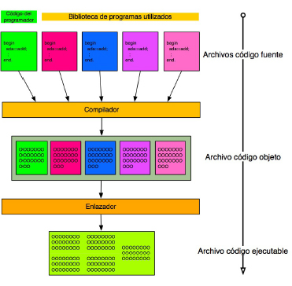

# UP1: DESARROLLO DEL SOFTWARE

## INDICE

- [OBJETIVOS](#objetivos)
- [1. CONCEPTO DE PROGRAMA INFORMÁTICO](#1-concepto-de-programa-informático)
  - [1.1. EJECUCIÓN Y ALMACENAMIENTO DE LOS PROGRAMAS](#11-ejecución-y-almacenamiento-de-los-programas)
  - [1.2. CLASIFICACIÓN FUNCIONAL DE LOS PROGRAMAS](#12-clasificación-funcional-de-los-programas)
    - [1.2.1. Software de Sistema](#121-software-de-sistema)
    - [1.2.2. Software de Aplicación](#122-software-de-aplicación)
  - [1.3. CALIDAD: CARACTERÍSTICAS DESEABLES DE LOS PROGRAMAS](#13-calidad-características-deseables-de-los-programas)
    - [1.3.1. Características Operativas (¿Funciona bien?)](#131-características-operativas-funciona-bien)
    - [1.3.2. Características de Mantenimiento (¿Se puede arreglar y mejorar?)](#132-características-de-mantenimiento-se-puede-arreglar-y-mejorar)
    - [1.3.3. Características de Adaptación (¿Se puede mover y reutilizar?)](#133-características-de-adaptación-se-puede-mover-y-reutilizar)
- [2. LENGUAJES DE PROGRAMACIÓN: DEFINICIÓN Y CONCEPTOS](#2-lenguajes-de-programación-definición-y-conceptos)
  - [2.1. DEFINICIÓN](#21-definición)
    - [2.1.1. El Origen y la Definición de los Lenguajes de Programación](#211-el-origen-y-la-definición-de-los-lenguajes-de-programación)
    - [2.1.2. La Anatomía de un Lenguaje de Programación](#212-la-anatomía-de-un-lenguaje-de-programación)
  - [2.2. TIPOS DE DATOS](#22-tipos-de-datos)
- [3. CLASIFICACIÓN DE LOS LENGUAJES DE PROGRAMACIÓN](#3-clasificación-de-los-lenguajes-de-programación)
  - [3.1. Por Nivel de Abstracción](#31-por-nivel-de-abstracción)
  - [3.2. Por Forma de Ejecución](#32-por-forma-de-ejecución)
  - [3.3. CLASIFICACIÓN POR EL PARADIGMA DE PROGRAMACIÓN](#33-clasificación-por-el-paradigma-de-programación)
    - [3.3.1. Paradigma Imperativo](#331-paradigma-imperativo)
    - [3.3.2. Paradigma Declarativo](#332-paradigma-declarativo)
  - [3.4. Por Sistema de Tipos](#34-por-sistema-de-tipos)
  - [3.5. Por Propósito](#35-por-propósito)
- [4. CÓDIGO Y MÁQUINAS VIRTUALES](#4-código-y-máquinas-virtuales)
- [5. AMPLIACIÓN](#5-ampliación)

## OBJETIVOS

Se pretende que el alumno consiga los siguientes objetivos al finalizar el tema:

- Reconocer la relación de los programas con los componentes del sistema informático, memoria, procesador, periféricos, entre otros.
- Clasificar los lenguajes de programación.
- Diferenciar los conceptos de código fuente, objeto y ejecutable.
- Reconocer las características de la generación de código intermedio para su ejecución en máquinas virtuales.
- Evaluar la funcionalidad ofrecida por las herramientas utilizadas en programación.

## 1. CONCEPTO DE PROGRAMA INFORMÁTICO

Un **programa informático** es una secuencia de instrucciones lógicas y ordenadas, escritas en un lenguaje de programación específico, que un ordenador puede interpretar y ejecutar para realizar una tarea concreta o resolver un problema. En esencia, un programa es el conjunto de órdenes que le dice al hardware (los componentes físicos del ordenador) qué debe hacer, cómo y en qué secuencia.

A menudo, este concepto se utiliza indistintamente con el de **software**, pero es útil entender su relación jerárquica para ser precisos. Un programa es la unidad fundamental del software (por ejemplo, la aplicación "Calculadora"), mientras que el software es un término más amplio que puede englobar un conjunto de programas que trabajan juntos (la suite "Microsoft Office") o un sistema operativo completo ("Windows 11"). Por lo tanto, todo programa es software, pero el software no es necesariamente un único programa.

Para que un programa pueda funcionar en un ordenador, debe recorrer un camino desde la idea del programador hasta las órdenes que el procesador entiende. Este proceso comienza con el **código fuente**, que son las instrucciones legibles para los humanos escritas en un **lenguaje de programación concreto** como Java, C# o Python. Dado que el procesador solo comprende un lenguaje de ceros y unos, conocido como **código máquina**, este código fuente necesita ser traducido.

Esta traducción del código fuente a código máquina puede realizarse de tres maneras principales:

- La **Compilación** traduce todo el código en un proceso secuencial de varias etapas que culmina en la creación de un fichero autónomo que la máquina puede ejecutar directamente.
- Por otro lado, la **Interpretación** lee y ejecuta el código línea por línea, en tiempo real, sin crear un fichero ejecutable previo.
- Por último, hoy en día, es muy común un **Modelo Híbrido**, usado por lenguajes como Java o los de la plataforma .NET: el código fuente se compila primero a un código intermedio llamado **bytecode**, y es una **Máquina Virtual** (un software que simula ser un ordenador) la que se encarga de ejecutar este bytecode, ofreciendo una gran portabilidad entre distintos sistemas operativos.

El resultado final de la compilación es el **código ejecutable** o **binario**, un fichero que contiene las instrucciones en código máquina (cadenas de 0s y 1s sólo comprensibles por la máquina). La forma de identificar estos ficheros varía según el sistema operativo: en la familia **Windows**, se utiliza comúnmente la extensión `.exe`; mientras que en sistemas **Unix/Linux**, no se requiere una extensión específica, sino que se marca el fichero con un permiso de ejecución. En ambos casos, el concepto es el mismo: un fichero listo para ser ejecutado por la CPU.

### 1.1. EJECUCIÓN Y ALMACENAMIENTO DE LOS PROGRAMAS

Un programa reside como un fichero ejecutable inactivo en un almacenamiento no volátil (disco duro, SSD), donde la información persiste sin energía. Al solicitar su ejecución, el Sistema Operativo lo carga en la memoria RAM, un medio volátil (su contenido se borra al apagar el equipo) pero de acceso mucho más rápido. Una vez allí, el Procesador (CPU) ejecuta sus instrucciones. A esta instancia de un programa en plena ejecución se le denomina proceso. Dicho proceso finaliza cuando completa su tarea, es cerrado por el usuario o sufre un error, liberando los recursos del sistema que ocupaba.

>[!NOTE]  
>Al almacenamiento no volátil se le denomina también memoria secundaria, y a la memoria RAM, memoria primaria.

### 1.2. CLASIFICACIÓN FUNCIONAL DE LOS PROGRAMAS

Para entender cómo funcionan e interactúan los distintos tipos de programas en un ordenador, la forma más útil de clasificarlos es según su **función y su proximidad al hardware**. Imagina que un sistema informático es como un edificio:

- El **Hardware** (CPU, RAM, disco duro) son los **cimientos y el terreno**. Es la base física indispensable sobre la que se construye todo.
- El **Software de Sistema** es la **infraestructura del edificio**: la red eléctrica, las tuberías, la estructura... No vives *dentro* de una tubería, pero sin ellas, el edificio es inútil.
- El **Software de Aplicación** son los **muebles y electrodomésticos**: el sofá, la televisión, el microondas... Son las herramientas que usas directamente para realizar tus tareas diarias.

Con esta analogía en mente, distinguimos dos grandes categorías:

---

### 1.2.1. Software de Sistema

Es el conjunto de programas que actúa como **intermediario entre el hardware y el software de aplicación**. Su misión es gestionar los recursos del ordenador y proporcionar un entorno estable para que el resto de los programas puedan funcionar. No está diseñado para el usuario final, sino para la propia máquina.

Sus componentes principales son:

- **Sistema Operativo (SO):** Es el software de sistema más importante, el "maestro de orquesta" del ordenador. Administra el hardware (memoria, CPU), gestiona los archivos, proporciona la interfaz de usuario y sirve de plataforma para el software de aplicación. **Ejemplos**: Windows, macOS, Linux, Android, iOS.
- **Controladores o *Drivers*:** Son "traductores" específicos que permiten al Sistema Operativo comunicarse con un componente de hardware concreto, como una tarjeta gráfica, una impresora o una webcam.
- **Utilidades del Sistema:** Son programas que realizan tareas de mantenimiento, configuración y optimización. **Ejemplos**: antivirus, herramientas de compresión de archivos, desfragmentadores de disco o software de diagnóstico.

---

### 1.2.2. Software de Aplicación

Este es el software diseñado para que el **usuario final** realice tareas específicas y resuelva problemas concretos. Son la razón de ser de un ordenador para la mayoría de las personas, ya que nos permiten trabajar, comunicarnos o entretenernos. Siempre se ejecutan *sobre* el software de sistema.

Podemos agruparlos en varias categorías según su propósito:

- **Ofimática:** Programas para la productividad en la oficina. **Ejemplos**: procesadores de texto (Word), hojas de cálculo (Excel), programas de presentaciones (PowerPoint). A menudo se venden en paquetes llamados **suites ofimáticas**.
- **Navegadores y Comunicación:** Herramientas para acceder a internet y comunicarnos. **Ejemplos**: Google Chrome, Mozilla Firefox, Slack, Zoom.
- **Diseño y Multimedia:** Software para la creación y edición de contenido visual y de audio. **Ejemplos**: Adobe Photoshop, AutoCAD, Spotify, VLC Media Player.
- **Gestión Empresarial:** Programas para automatizar procesos de negocio. **Ejemplos**: software de contabilidad (Contasimple), sistemas de gestión de almacenes, o aplicaciones **desarrolladas a medida** para una empresa específica.
- **Bases de Datos y Desarrollo:** Herramientas para gestionar grandes volúmenes de datos y para crear nuevo software. **Ejemplos**: MySQL, Oracle, y los **Entornos de Desarrollo Integrado (IDE)** como Visual Studio Code o Eclipse.

Dentro del software de aplicación, especialmente en el entorno empresarial, es útil distinguir cómo se adquiere y adapta el software:

- **Software COTS (Commercial-Off-The-Shelf):** Es software "de estantería", un producto estándar creado para un mercado masivo. Se compra y se usa tal cual. **Ejemplo:** Microsoft Office, Adobe Photoshop.
- **Software a Medida (Bespoke):** Es software creado desde cero para un cliente específico, cubriendo necesidades que ningún producto estándar puede satisfacer. Es como un traje hecho a medida. **Ejemplo:** el sistema de reservas de Renfe.
- **Software Configurable/Parametrizable:** Es un híbrido. Se parte de un software estándar muy potente y complejo (un "core") que luego se adapta y configura extensamente para los procesos específicos de una empresa, sin alterar el código fuente original. **Ejemplo:** los sistemas ERP como **SAP** o Salesforce, que son moldeados por consultores para cada cliente.

En resumen, el **software de sistema** hace que el ordenador *funcione*, mientras que el **software de aplicación** hace que el ordenador sea *útil* para nosotros.

### 1.3. CALIDAD: CARACTERÍSTICAS DESEABLES DE LOS PROGRAMAS

Las características que definen un software de calidad se pueden agrupar en tres perspectivas principales: cómo opera, cómo se mantiene y cómo se adapta a nuevos entornos.

#### 1.3.1. Características Operativas (¿Funciona bien?)

Se refieren al comportamiento del programa mientras está en ejecución.

- **Corrección** ✅: Es la característica fundamental. El software hace exactamente lo que se especificó en los requisitos, sin errores funcionales.
- **Fiabilidad (dependability)**: Más allá de ser correcto, un programa fiable funciona de manera predecible y sin fallos durante un largo periodo de tiempo y bajo condiciones establecidas.
- **Eficiencia** ⚡: Realiza sus tareas utilizando la menor cantidad de recursos posible (tiempo de CPU, consumo de memoria, ancho de banda de red).
- **Integridad y Seguridad** 🛡️: Protege la información que maneja contra accesos no autorizados y previene la corrupción de datos.
- **Usabilidad** 👍: La facilidad con la que un usuario puede aprender a utilizar el programa, operarlo y la satisfacción que le produce. Un software puede ser correcto pero inusable.
- **Accesibilidad** ♿: La capacidad del software para ser utilizado por el mayor número de personas posible, incluyendo aquellas con algún tipo de discapacidad, garantizando una experiencia de usuario equitativa.

#### 1.3.2. Características de Mantenimiento (¿Se puede arreglar y mejorar?)

Se centran en la estructura interna del código y su facilidad para ser modificado a lo largo del tiempo.

- **Claridad y Legibilidad** 📖: El código fuente es fácil de leer y entender por otros programadores (o por el autor en el futuro). Esto se logra con buen nombrado, comentarios útiles y una estructura lógica.
- **Facilidad de Mantenimiento (Mantenibilidad)** 🔧: La facilidad con la que se puede localizar y corregir un error (mantenimiento correctivo) o realizar una modificación (mantenimiento adaptativo). Depende directamente de la claridad.
- **Flexibilidad y Escalabilidad (expandable)**: La capacidad del software para ser modificado fácilmente para añadir nuevas funcionalidades o para soportar un mayor volumen de datos o usuarios sin necesidad de rediseñarlo por completo.
- **Facilidad de Prueba (Testabilidad)** 🔬: La facilidad con la que se pueden diseñar y ejecutar pruebas para verificar que el software funciona correctamente tras cada cambio.

#### 1.3.3. Características de Adaptación (¿Se puede mover y reutilizar?)

Evalúan la capacidad del software para adaptarse a diferentes entornos y contextos.

- **Portabilidad**: La capacidad del software para ejecutarse en diferentes plataformas de hardware, sistemas operativos o navegadores con un mínimo de modificaciones.
- **Reusabilidad** ♻️: El grado en que los componentes del software (clases, módulos, funciones) pueden ser extraídos y utilizados en el desarrollo de otros programas.
- **Interoperabilidad** 🤝: La capacidad del software para comunicarse e intercambiar datos de forma efectiva con otros sistemas o aplicaciones, por ejemplo, a través de APIs.

## 2. LENGUAJES DE PROGRAMACIÓN: DEFINICIÓN Y CONCEPTOS

### 2.1. DEFINICIÓN

#### 2.1.1. El Origen y la Definición de los Lenguajes de Programación

En los inicios de la computación, los programas se escribían directamente en el único idioma que el procesador entiende: el **código máquina**, una compleja secuencia de ceros y unos. Aunque era un método efectivo, resultaba extremadamente tedioso y propenso a errores para los humanos.

Para solucionar esto, nacieron los **lenguajes de programación**. Su objetivo es servir de **puente entre la lógica humana y las instrucciones del hardware**. Nos permiten escribir órdenes con una notación más cercana a nuestro pensamiento, que luego un **compilador** o un **intérprete** se encarga de traducir de nuevo a ese código máquina de ceros y unos.

Podemos definirlos formalmente como:
> Un sistema de notación formal, compuesto por un conjunto de símbolos y reglas (gramática), que permite a un programador escribir instrucciones para controlar el comportamiento de un sistema informático.

---

#### 2.1.2. La Anatomía de un Lenguaje de Programación

Al igual que los idiomas que hablamos (castellano, inglés...), todo lenguaje de programación se estructura en tres niveles o capas que definen su gramática.

**1. Nivel Léxico (El Vocabulario)** 🔡

Es la base de todo. Define el conjunto de **símbolos y palabras** (componentes léxicos o *tokens*) que el lenguaje reconoce como válidos. Es el "alfabeto" y el "diccionario" del lenguaje. Aquí encontramos:

- **Identificadores**: Nombres que damos a las variables, funciones, clases, etc. (Ej: `edad`, `calcularTotal`).
- **Palabras Reservadas (Keywords)**: Términos con un significado especial que no podemos usar como identificadores (Ej: `if`, `while`, `class`, `return`).
- **Literales**: Valores fijos que escribimos directamente en el código. Pueden ser constantes (Ej: `PI = 3.1416`) o valores directos (Ej: `"Hola"`, `25`, `true`).
- **Operadores**: Símbolos que representan una acción o cálculo (Ej: `+`, `-`, `=`, `>`).
- **Separadores y Símbolos de Puntuación**: Caracteres que estructuran el código (Ej: `( )`, `{ }`, `;`, `,`).

**2. Nivel Sintáctico (La Gramática)** 📏

Define las **reglas para combinar los elementos léxicos** y formar "frases" (instrucciones) válidas y coherentes. Si el léxico son las palabras, la sintaxis es cómo se construyen oraciones con sujeto, verbo y predicado.

- **Ejemplo**: La sintaxis del operador suma (`+`) exige que tenga un operando a su izquierda y otro a su derecha (`5 + 3`). Escribir `+ 5 3` sería un **error sintáctico** en la mayoría de los lenguajes.

**3. Nivel Semántico (El Significado)** 💡

Es el nivel más alto y se ocupa del **significado de las instrucciones sintácticamente correctas**. Una frase puede ser gramaticalmente perfecta, pero no tener sentido. La semántica define qué acción debe realizar el ordenador cuando interpreta una instrucción.

- **Ejemplo**: La instrucción `print("hola");` es léxica y sintácticamente correcta. Su **significado semántico** es "mostrar la cadena de texto 'hola' por la salida estándar del sistema (normalmente, la pantalla)".

**4. Un Elemento Transversal: Los Comentarios** 💭

Finalmente, existen los **comentarios**. No son un elemento léxico, sintáctico ni semántico desde el punto de vista del compilador (que los ignora por completo), sino una herramienta fundamental para el programador. Son anotaciones en el código fuente que sirven para **documentar y aclarar** su funcionamiento, facilitando enormemente su mantenimiento futuro.

### 2.2. TIPOS DE DATOS

En programación, toda variable o constante pertenece a un **tipo de dato**. Un tipo de dato es un atributo que le indica al sistema dos cosas fundamentales:

1. La **naturaleza de los valores** que puede almacenar (su dominio).
2. Las **operaciones que se pueden realizar** con dichos valores.

Los tipos de datos se clasifican principalmente en dos categorías:

 **Tipos de Datos Primitivos:**

Son los más básicos y fundamentales, la base sobre la que se construyen todos los demás.

- **Enteros (`int`)**: Representan números completos sin decimales (positivos, negativos o cero). Ej: `1024`, `-25`, `0`.
- **Reales o de Coma Flotante (`float`, `double`)**: Representan números con parte decimal, permitiendo una mayor precisión. Ej: `3.14159`, `-0.001`, `1.2e5`.
- **Booleanos (`bool`)**: Representan valores de lógica binaria. Solo pueden contener dos estados: **verdadero** (`true`) o **falso** (`false`).
- **Carácter (`char`)**: Representa un único símbolo, como una letra, un número o un signo de puntuación. Ej: `'A'`, `'7'`, `'@'`. A partir de ellos se forman las **Cadenas de texto (`string`)**, que son secuencias de caracteres. Ej: `"Hola, mundo"`.

**Tipos de Datos Compuestos (o Estructurados):**

Son tipos más complejos que se construyen agrupando o estructurando tipos de datos primitivos. Permiten representar realidades más complejas.

- **Ejemplos**: **Arrays** (listas), **diccionarios** (mapas), **tuplas**, **pilas**, **colas** o los **objetos** definidos por el programador a través de clases.

## **3. CLASIFICACIÓN DE LOS LENGUAJES DE PROGRAMACIÓN**

La cantidad de lenguajes de programación es abrumadora. Para navegar este ecosistema, no basta con conocerlos individualmente; necesitamos criterios para clasificarlos y entender sus fortalezas y filosofías. Aunque existen muchos criterios, nos centraremos en cinco dimensiones clave que nos dan una visión completa de cualquier lenguaje.

---

### 3.1. POR NIVEL DE ABSTRACCIÓN

El **nivel de abstracción** mide la distancia entre el lenguaje y el hardware de la máquina. Cuanto más alto es el nivel, más se parece el lenguaje al pensamiento humano y menos nos preocupamos por los detalles de la máquina (gestión de memoria, registros de la CPU).

**Bajo Nivel (1GL - Primera Generación)** 🤖

- **Lenguaje Máquina**: Es el único idioma que la CPU entiende de forma nativa. Consiste en secuencias de ceros y unos. Hoy en día, ningún programador escribe directamente en código máquina; es el destino final al que los compiladores traducen nuestro código. Ejemplo: la secuencia binaria `1110101100010001` (`0xEB11` en hexadecimal) en la arquitectura x86 (la típica de nuestros PCs) produce un salto a la posición relativa `0x11`.

**Nivel Intermedio (2GL y algunos 3GL)** ⚙️

- **Lenguaje Ensamblador (2GL)**: El lenguaje ensamblador es una representación simbólica del código máquina de un procesador específico. Utiliza instrucciones nemotécnicas como `MOV`, `ADD` o `JMP`, que reflejan operaciones básicas directamente ejecutables por la CPU, en lugar de cadenas de ceros y unos.

Este lenguaje está completamente ligado a la arquitectura concreta para la que se programa, ya que cada tipo de procesador tiene su propio conjunto de mnemónicos e instrucciones. Programar en ensamblador permite un control extremadamente preciso del hardware, lo que resulta esencial en ámbitos como sistemas embebidos, desarrollo de controladores (drivers), bootloaders, partes críticas de sistemas operativos y tareas que exigen la máxima optimización de recursos. A pesar de su dificultad y baja portabilidad, otorga ventajas como el acceso directo a los recursos internos (registros, memoria, periféricos) y la posibilidad de generar código muy eficiente en términos de velocidad y consumo. Cabe mencionar que, los compiladores modernos de lenguajes de alto nivel suelen generar código casi tan eficiente como el ensamblador, aunque este sigue siendo insustituible para manipulación directa del hardware y casos de máxima optimización.

- **Alto Nivel (3GL y 4GL)** 🧠
  - **Tercera Generación (3GL)**: Son la gran mayoría de lenguajes de propósito general. Se centran en la lógica del algoritmo y abstraen por completo el hardware. Una sola instrucción en 3GL puede equivaler a docenas de instrucciones en código máquina. **Ejemplos**: C++, Java, Python, C#, JavaScript.
  - **Cuarta Generación (4GL)**: Son lenguajes de **dominio específico** (DSL), diseñados para resolver problemas en un área concreta de forma muy eficiente, reduciendo drásticamente el código necesario. **Ejemplos**: **SQL** (para bases de datos), MATLAB (para cálculo numérico), R (para estadística).

En términos generales podemos decir que los lenguajes de 3GL se centran más en el "cómo" (algoritmos y estructuras de datos), mientras que los 4GL se centran en el "qué" (describir el problema y la solución de alto nivel).

>[!NOTE]
> Algunos lenguajes de **3GL como C** son a menudo considerados de "nivel intermedio" porque, aunque son de alto nivel, proporcionan herramientas (como los punteros) que permiten una manipulación de la memoria casi tan directa como en ensamblador.

- **Nivel Muy Alto (5GL)** 💡
  - **Quinta Generación**: También llamados lenguajes lógicos o declarativos avanzados. El programador se centra en describir las restricciones del problema y el estado final deseado, y el sistema, a menudo usando técnicas de IA (que no LLMs), deduce la solución. **Ejemplos**: Prolog, Mercury.

---

### 3.2. POR FORMA DE EJECUCIÓN

Este criterio describe el proceso que transforma nuestro código fuente en acciones que el ordenador realiza. Hay tres modelos principales:

**Compilados**: El código fuente se traduce **una sola vez** por un **compilador** a código máquina, generando un fichero ejecutable (`.exe`). Este fichero es autónomo y se ejecuta a la máxima velocidad posible, pero es dependiente de la plataforma (un `.exe` de Windows no funciona en macOS). **Ejemplos**: C, C++, Rust, Go.

**Interpretados**: No hay un paso de compilación previo. Un programa **intérprete** lee el código fuente línea por línea y lo ejecuta sobre la marcha. Son más lentos pero multiplataforma (el mismo código funciona en cualquier sistema que tenga el intérprete). **Ejemplos**: Python (en modo interactivo), JavaScript (en el navegador), scripts de Shell.

**Híbridos o Gestionados (Máquina Virtual)**: Es la combinación de ambos mundos. El código fuente se compila a un código intermedio llamado **bytecode**. Este bytecode no es código máquina, sino un lenguaje universal que es ejecutado por una **Máquina Virtual (VM)**. La VM actúa como un intérprete avanzado que a menudo optimiza el código en tiempo real (compilación JIT - *Just-In-Time*). Ofrece portabilidad ("escribe una vez, ejecuta en cualquier lugar") con un rendimiento muy bueno. **Ejemplos**: Java (JVM).

---

### 3.3. CLASIFICACIÓN POR EL PARADIGMA DE PROGRAMACIÓN

Un **paradigma de programación** es una "filosofía", un estilo o un enfoque particular para la construcción de software. Define cómo estructuramos y pensamos sobre nuestros programas. La mayoría de los lenguajes modernos son **multi-paradigma**, lo que significa que nos permiten mezclar diferentes estilos según la naturaleza del problema a resolver.

La división más fundamental entre los paradigmas es si le decimos al ordenador **"cómo"** hacer algo o **"qué"** queremos que haga.

---

#### 3.3.1. Paradigma Imperativo

En este paradigma, le dices al ordenador **cómo** hacer algo. El programador describe, paso a paso, la secuencia de operaciones que deben realizarse para cambiar el estado de un programa y alcanzar el resultado final. Se fundamenta en la asignación a variables y en la manipulación directa de datos.

##### **Programación Procedimental y Estructurada**

Es la evolución natural de la programación imperativa. El código se organiza en bloques más pequeños y reutilizables llamados **procedimientos** o **funciones**. Esto resuelve el problema del "código spaghetti" y facilita la legibilidad. La programación estructurada se basa en el uso exclusivo de tres estructuras de control básicas:

- **Secuencia**: Las instrucciones se ejecutan una tras otra, en el orden en que están escritas.
- **Selección (o Condición)**: Permite ejecutar un bloque de código u otro en función de que se cumpla una condición (`if-then-else`).
- **Iteración (o Repetición)**: Permite ejecutar un bloque de código repetidamente mientras se cumpla una condición (`while`, `for`).

**Ejemplos de lenguajes principalmente procedimentales**: C, Pascal, FORTRAN, COBOL.

---

##### **Programación Orientada a Objetos (POO)**

Es el paradigma imperativo más extendido hoy en día. En lugar de centrarse en la lógica de los procedimientos, la POO modela el problema como un conjunto de **objetos** que interactúan entre sí. Un objeto es una entidad que agrupa **datos (atributos)** y **comportamiento (métodos)**.

Por ejemplo, un objeto `Lavadora` puede tener atributos como `peso_de_la_carga` y `estado_actual`, y métodos como `Lavar()` o `Centrifugar()`. Las cuatro características (o pilares) que definen la POO son:

- **Abstracción**: Permite modelar las características esenciales de un objeto, ignorando los detalles irrelevantes. El objeto `Lavadora` expone una interfaz simple (`Lavar()`) sin necesidad de que sepamos cómo funciona su motor interno.
- **Encapsulamiento**: Oculta el estado interno (los atributos) de un objeto y obliga a que toda la interacción se realice a través de sus métodos. No podemos cambiar directamente el `tiempo_restante`; solo podemos pedirle a la lavadora que inicie un ciclo, y ella gestionará ese tiempo internamente.
- **Herencia**: Permite que una clase (`LavadoraSecadora`) "herede" los atributos y métodos de otra clase (`Lavadora`), pudiendo añadir nueva funcionalidad (como el método `Secar()`) o especializar la existente. Fomenta la reutilización de código.
- **Polimorfismo**: Permite que objetos de diferentes clases, que han heredado de una misma clase padre, puedan responder al mismo mensaje (al mismo método) de formas diferentes. Por ejemplo, si tuviéramos un método `ConsumirEnergia()`, una `Lavadora` y una `LavadoraSecadora` lo implementarían de manera distinta.

**Ejemplos de lenguajes con fuerte soporte a POO**: Java, C#, C++, Python, Ruby.

---

#### 3.3.2. Paradigma Declarativo

En este paradigma, le dices qué quieres. El programador no describe el algoritmo paso a paso, sino que especifica el resultado que desea obtener. El motor del lenguaje se encarga de encontrar la mejor manera de alcanzar ese resultado.

##### **Programación Lógica**

Se basa en la lógica formal. El programador define un conjunto de **hechos** (cosas que son verdad) y **reglas** lógicas. Luego, puede hacer "preguntas" al sistema, que utilizará la inferencia lógica para deducir la respuesta. **Ejemplo**: En **Prolog**, se pueden definir reglas como "Sócrates es un hombre" y "Todos los hombres son mortales", y luego preguntar "¿Es Sócrates mortal?".

##### **Programación Funcional**

Se inspira en las matemáticas. Trata la computación como la evaluación de funciones matemáticas y evita el estado mutable y los datos compartidos. Sus principios clave son el uso de **funciones puras** (que para la misma entrada, siempre producen la misma salida, sin efectos secundarios) y la **inmutabilidad** (los datos no se modifican una vez creados).

- **Ejemplo**: En lugar de un bucle para duplicar los números de una lista, se usarían funciones que operan sobre colecciones: `numeros.map(n -> n * 2)`.
- **Lenguajes**: Haskell, LISP, y características funcionales en Python, JavaScript, etc.

##### **Lenguajes de Consulta a Bases de Datos**

Son el ejemplo más claro de lenguaje declarativo. **Ejemplo**: En **SQL**, al escribir `SELECT nombre FROM articulos WHERE precio > 5`, declaramos **qué** datos queremos, sin especificar los pasos que debe seguir el sistema de base de datos para encontrarlos y devolverlos.

---

Fíjate en el siguiente ejemplo y cómo con un mismo lenguaje de programación (Python) podemos resolver el mismo problema empleando diferentes paradigmas. No te preocupes si todavía no entiendes el código, lo importante es la idea.

**Problema**: Dada una lista de números, crea una nueva lista solo con el doble de los números pares.

- **Python Imperativo.Procedimental**:

    ```python
    nueva_lista = []
    for numero in lista_original:
        if numero % 2 == 0:
            nueva_lista.append(numero * 2)
    ```

- **Python Declarativo.Funcional**:

    ```python
    nueva_lista = list(map(lambda x: x * 2, filter(lambda x: x % 2 == 0, lista_original)))
    ```

---

### 3.4. POR SISTEMA DE TIPOS

La tipificación (o sistema de tipos) define las reglas sobre cómo el lenguaje maneja los tipos de datos (entero, texto, booleano...). Hay dos ejes para clasificarlo:

- **Eje 1: ¿Cuándo se comprueban los tipos?**
  - **Tipado Estático**: Los tipos de las variables se comprueban **en tiempo de compilación**. Atrapa errores de tipo antes de ejecutar el programa. Aporta seguridad y rendimiento. **Ejemplos**: Java, C++, C#, Rust.
  - **Tipado Dinámico**: Los tipos se comprueban **en tiempo de ejecución**. Ofrece más flexibilidad y rapidez al escribir código, pero los errores de tipo solo aparecen cuando el programa se ejecuta. **Ejemplos**: Python, JavaScript, Ruby, PHP.

- **Eje 2: ¿Cuán estrictas son las reglas?**
  - **Tipado Fuerte**: El lenguaje prohíbe operaciones entre tipos incompatibles. Intentar sumar un número y un texto (`5 + "hola"`) generalmente produce un error. Aporta robustez y previene comportamientos inesperados. **Ejemplos**: Python, Java, C#.
  - **Tipado Débil**: El lenguaje intenta "adivinar" lo que quieres hacer, realizando conversiones de tipo implícitas (coerción). `5 + "hola"` podría resultar en `"5hola"`. Puede ser conveniente pero también una fuente de errores sutiles. **Ejemplos**: JavaScript, PHP, C.

>[!NOTE]
> ¡Cuidado! Estos ejes son independientes. Por ejemplo, **Python** es Dinámico y Fuerte, mientras que **Java** es Estático y Fuerte. **JavaScript** es Dinámico y Débil.

---

### 3.5. POR PROPÓSITO

- **Lenguajes de Propósito General (GPL):** Diseñados para resolver una amplia variedad de problemas en diferentes dominios. La mayoría de los lenguajes populares entran en esta categoría. **Ejemplos**: Python, Java, C++, JavaScript, C#.

- **Lenguajes de Dominio Específico (DSL):** Creados para una tarea muy concreta, ofreciendo una sintaxis y funcionalidades optimizadas para ella. **Ejemplos**: **SQL** (consultas a bases de datos), **HTML/CSS** (estructura y estilo de páginas web), **LaTeX** (composición de documentos científicos), **Gherkin** (para definir tests de comportamiento).

## 4. CÓDIGO Y MÁQUINAS VIRTUALES

Durante la fase de programación se generan distintos tipos de código:

- **Código fuente**: es el escrito directamente por los programadores en editores de texto. Se compone de uno o más ficheros de texto, cada uno de los cuales contiene un conjunto de instrucciones codificadas en algún lenguaje de alto nivel.
- **Código objeto**: es el código binario resultante de compilar el código fuente. Por tanto, el responsable de generar código objeto es el compilador. El código objeto es inteligible para el ser humano (generalmente está en formato binario), sin embargo, tampoco es directamente ejecutable por el ordenador. El compilador genera un fichero de código objeto por cada fichero de código fuente. Aquellos ficheros de código objeto que comparten una finalidad común se suelen agrupar en librerías.
- **Código ejecutable**: es el resultante de enlazar uno o más fragmentos de código objeto con las librerías necesarias. El resultado es un archivo que el sistema operativo es capaz de cargar y ejecutar en memoria. El responsable de construir el ejecutable es el enlazador o linker. Los ficheros con código ejecutable también tienen formato binario, y un ejemplo de ellos en arquitecturas windows son los archivos con extensiones **exe** o **dll**.

[](img/UP01/fuente_objeto_ejecutable.jpg)

Por otro lado, existen lenguajes de programación que no generan código objeto ni ejecutable, sino que generan un código intermedio que es ejecutado por una máquina virtual. Este modelo de ejecución tiene las siguientes características:

- **Código intermedio**: es un código que se encuentra entre el código fuente y el código ejecutable. No es directamente ejecutable por el sistema operativo, pero puede ser interpretado o compilado en tiempo de ejecución por una máquina virtual. Este enfoque permite una mayor portabilidad entre diferentes plataformas.
- **Máquinas virtuales**: es un entorno de ejecución que actúa como intermediario entre el sistema operativo y el programa. Ejecuta el código previamente compilado (**bytecode**). Permite programar de manera independiente del sistema; tan sólo es preciso que exista la máquina virtual para este. El ejemplo más característico es el lenguaje **Java**. Cualquier sistema que tenga instalado el **JRE (Java Runtime Environment)** puede ejecutar el código previamente compilado (bytecode).

## 5. AMPLIACIÓN

Material de ampliación disponible en [UP01-Ampliación](UP01-Ampliacion.md).
